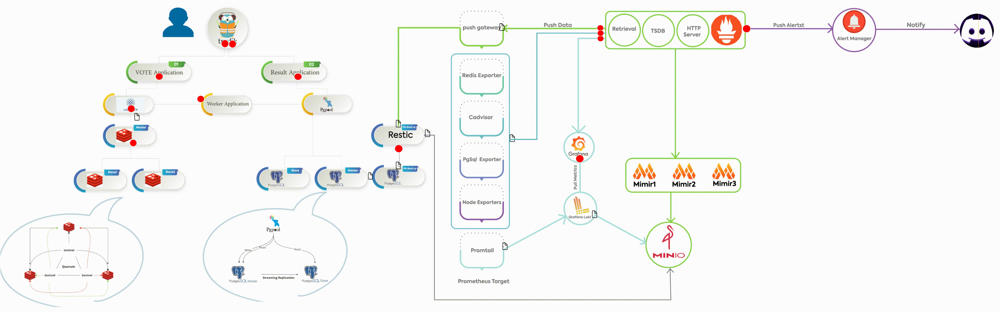

# Project Overview

This repository contains a comprehensive setup for deploying multiple services using Docker Swarm across a 3-node cluster with Traefik as the reverse proxy. The setup includes various services such as a backup server, MinIO for storage, Vaultwarden for secure password management, PostgreSQL and Redis for data storage, a voting app, and WordPress for content management. The project is designed to streamline DevOps tasks and automate service deployments in a distributed environment.

## Service Overview

This GIF provides a visual representation of the project’s structure and the interaction between services. Each component is configured to communicate securely and efficiently within the Docker Swarm network, with Traefik managing routing for each service.




### Services Included

1. **Traefik**: Manages routing for all services, with HTTPS enabled for secure connections.
2. **MinIO**: Object storage service, accessible via Traefik, useful for storing backups and other files.
3. **Vaultwarden**: Secure password management solution, routed through Traefik for secure access.
4. **Backup Server**: Handles scheduled backups, connecting to MinIO for storage and PostgreSQL for database backups.
5. **Vote Stack**: A voting application stack that includes services like Vote, Result, Worker, and Redis.
6. **Redis**: Separate Redis service for caching and session management within the voting app.
7. **PostgreSQL**: Database stack for managing persistent data needs.
8. **MariaDB (for WordPress)**: Database stack used specifically for the WordPress service.
9. **WordPress**: Content management system for building a website or blog.
10. **Semaphore**: CI/CD solution for automating Ansible deployments.

Each service is configured to work within Docker Swarm and is isolated within its own network to maintain security and organization.

## Project Structure

```
.
├── ansible/
│   └── hardening/            # Ansible hardening scripts for server security
├── backup-server/            # Contains backup service configurations
├── minio/                    # Configuration for MinIO service
├── semaphore/                # Semaphore CI/CD setup
├── traefik/                  # Traefik configurations and certificates
├── trivy/                    # Security scanning configurations
├── vault/                    # Vaultwarden setup for password management
├── voting-app/               # Voting application with Redis, PostgreSQL, and Vote/Result services
├── wordpress/                # WordPress and MariaDB stack
└── deploy.sh                 # Main deployment script for all services
```

## Prerequisites

To deploy this project, you need a Docker Swarm cluster with **three nodes** set up. Ensure Docker is installed on each node and Swarm is initialized. Follow these steps:

### 1. Set Up Docker on Each Node

Install Docker on each of your nodes (e.g., `node1`, `node2`, and `node3`). Ensure that each node is reachable over the network and that they can communicate with each other.


### 2. Initialize Docker Swarm on the Manager Node

On the main (manager) node (e.g., `node1`), initialize Docker Swarm:

```bash
docker swarm init --advertise-addr <MANAGER-IP>
```

Replace `<MANAGER-IP>` with the IP address of the manager node.

### 3. Join Worker Nodes to the Swarm

On `node1`, Docker will provide a `docker swarm join` command with a token. Run this command on each worker node (e.g., `node2` and `node3`) to join them to the Swarm cluster.

Example:

```bash
docker swarm join --token <SWARM-TOKEN> <MANAGER-IP>:2377
```

Replace `<SWARM-TOKEN>` and `<MANAGER-IP>` with the values provided by the `docker swarm init` command.

### 4. Verify Swarm Nodes

On the manager node (`node1`), check that all nodes have joined the Swarm successfully:

```bash
docker node ls
```

You should see all three nodes listed, with `node1` as the leader and `node2` and `node3` as workers.

### 5. Set Up Overlay Network

The `deploy.sh` script will automatically create the necessary overlay networks for inter-service communication. Ensure that the `web_net`, `minio_net`, and `pg_net` networks are created across the Swarm.

## Deployment

### Step-by-Step Guide to Deploying the Project

The entire project can be deployed using the `deploy.sh` script, which handles the setup for all services in a predefined order. This script creates the necessary Docker overlay networks, loads environment variables, and deploys each service stack sequentially across the 3-node Swarm cluster.

To deploy the project, follow these steps:

1. **Run the Deployment Script**:
    Execute the following command in the root directory to deploy all services:
    ```bash
    ./deploy.sh
    ```

   The script will:
   - Create necessary networks (`web_net`, `minio_net`, `pg_net`).
   - Source environment files and deploy each service stack (e.g., `traefik`, `minio`, `vault`, `backup`, etc.).
   - Deploy each stack sequentially, setting up Traefik as the main reverse proxy to handle HTTPS routing for all services.

2. **Verify Services**:
   After the script completes, use `docker stack ls` on the manager node to check that all services are running. You can also view detailed service information with:
   ```bash
   docker service ls
   ```

3. **Access Services**:
   Each service is accessible via its designated subdomain (e.g., `https://vault.devops.harimi.ir` for Vaultwarden) as configured in Traefik.

## Individual Service Documentation

Each service has a dedicated README.md in its directory with more detailed instructions and configuration notes:
- **[Ansible Hardening](ansible/hardening/README.md)**
- **[Backup Server](backup-server/README.md)**
- **[MinIO](minio/README.md)**
- **[Semaphore CI/CD](semaphore/README.md)**
- **[Traefik](traefik/README.md)**
- **[Trivy](trivy/README.md)**
- **[Vaultwarden](vault/README.md)**
- **[Voting App](voting-app/README.md)**
- **[WordPress](wordpress/README.md)**

Refer to each README file for environment variable configurations, network details, and specific setup instructions.

---

This documentation provides a comprehensive guide for setting up, deploying, and understanding each component in your multi-node Docker Swarm project. Each section is crafted to ensure ease of deployment and maintenance within a distributed environment.